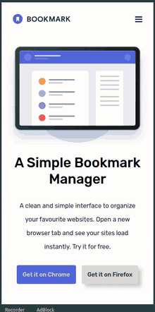
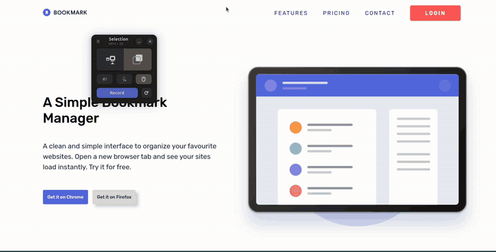

# Bookmark Landing Page

Landing page responsive del challenge de frontend mentor. Disfrute mucho este reto porque es de nivel intermedio.

## Demo

🔗 [Ver sitio](https://francocam1.github.io/challenge-landing-page-bookmark/)
## Features
- Estructura HTML semántica 
- Mobile-first
- Layouts con Flexbox y Grid
- Diseño responsive mobile y desktop
- Navegación interactiva de features
- FAQ accordion con JavaScript
- Animaciones y transiciones con CSS

## Preview

### Mobile

  

### Desktop

  

## Tecnologías

- HTML5
- CSS3
- JavaScript